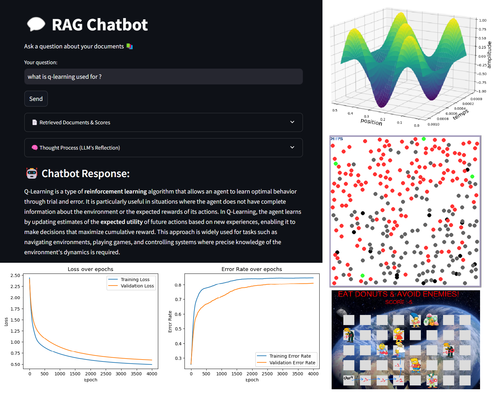

<h1 align="center">👋 Welcome, I'm Alexia!</h1>  
<h3 align="center">Engineer in Applied Mathematics & Computer Science 🎓 </h3>  
<h3 align="center"> ✨ Aspiring Data Scientist | Passionate about AI 🤖 ✨</h3>  

## 🛠 Technologies & Skills  
- Programming in **Python, C#, C++, R**.
- Data Science & Analysis with **Pandas, NumPy, SciPy, Matplotlib, Seaborn**.  
- Machine Learning and Deep Learning with **Scikit-learn**, **Pytorch** and **Keras**.
- Interactive UI for AI/ML with **Streamlit**, **Gradio**.
- LLM engineering with **Langchain, Haystack**.
- Data analysis/science in **R** and **Python**.
- Numerical simulations in **Python**.

## 🧠 Models & Architectures  
- **LLMs**: LLaMA, Mistral, DeepSeek  
- **Others**: XGBoost, LightGBM, Random Forest, ResNet, ...
<!-- soon YOLO, SAM, ... -->

<h3 align="left">📫 Let's Connect! </h3>

<!--
TODO: image des outils pour plus d'esthétique : <h3 align="left">Languages and Tools:</h3>

 
 

 
 

-->

## 🔎 Projects Overview

